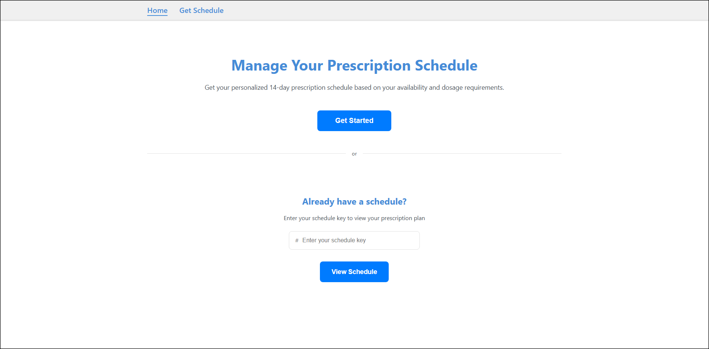
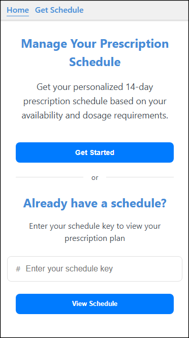
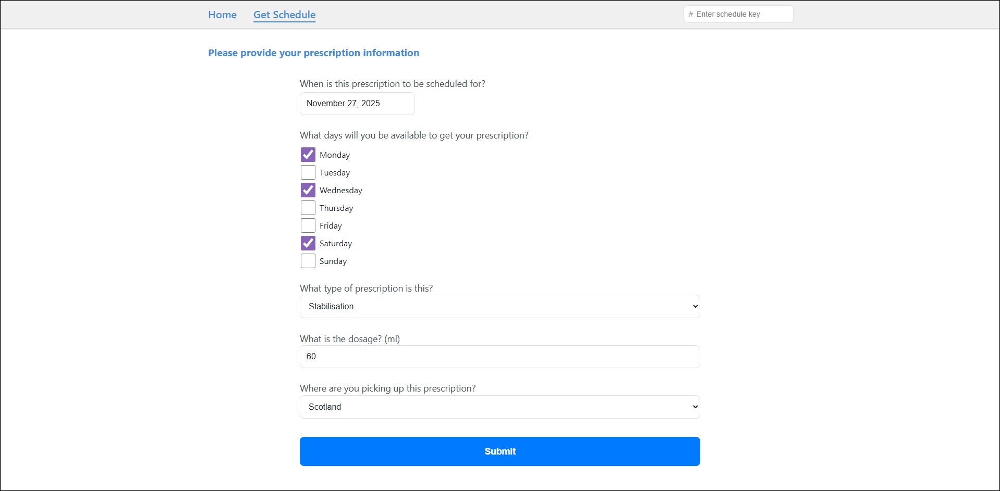
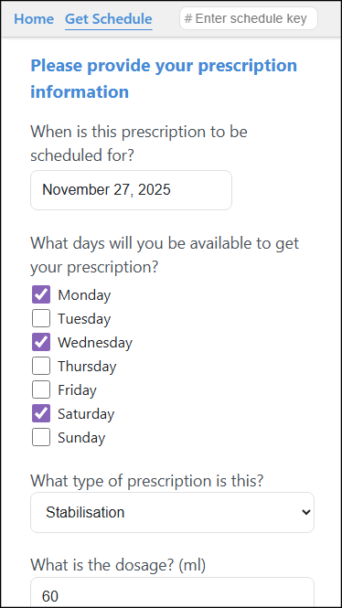
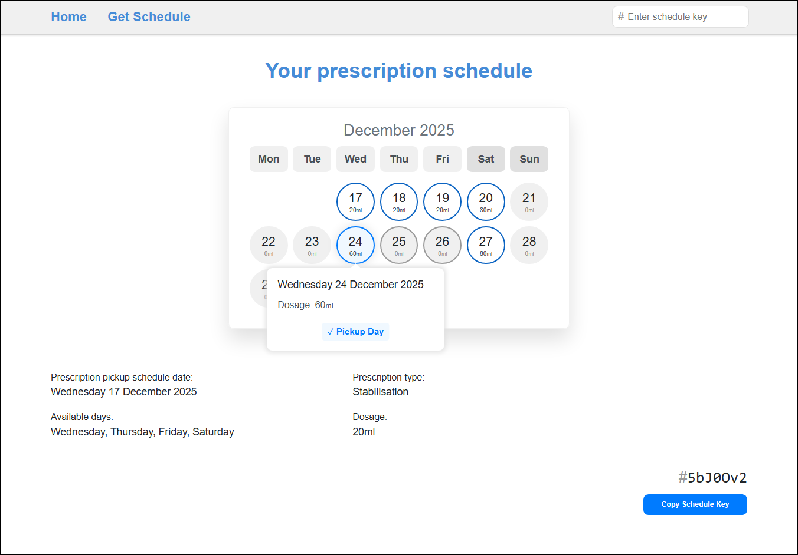
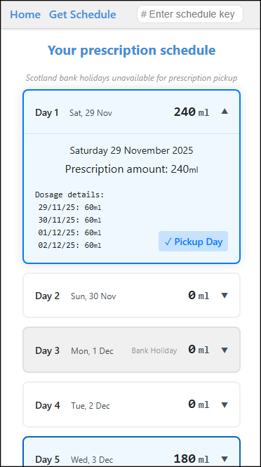

# Prescription Scheduling App

**[🔗 View Live Demo](https://lindenholt-whittaker.github.io/PrescriptionSchedule/)**

A React-based web application that generates a 14-day prescription pickup schedules based on user availability and dosage requirements.

## Overview

This application helps users plan their prescription pickups by:
- Selecting available days for collection
- Defining prescription type (stabilisation, reducing, or increasing)
- Defining dosage amounts (initial dosage, and any change in prescription based on type)
- Automatically calculating dosages across the schedule period
- Accounting for UK bank holidays (currently only England and Wales)

## Features

- Interactive Calendar: Visual 14-day schedule with desktop grid and mobile list views
- Dynamic Dosage Calculation: Automatic computation for increasing/reducing prescriptions
- Bank Holiday Integration: Uses UK Government API to avoid pickup on holidays (currently only England and Wales holidays)
- Shareable Schedule Keys: Compact encoded URLs for sharing schedules
- Fully Responsive: Optimized for mobile, tablet, and desktop
- Modern UI: Clean interface with smooth animations and transitions

## Screenshots

| Desktop | Mobile |
|---------|--------|
|  |  |
|  |  |
|  |  |

## Tech Stack

- **Framework:** React 18 with TypeScript
- **Build Tool:** Vite
- **Styling:** SCSS with BEM methodology

## Getting Started

### Prerequisites

- Node.js (v16 or higher)
- npm or yarn

### Installation

Install dependencies
```bash
npm install
```

Run the development server
```bash
npm run dev
```

Open http://localhost:5173 in your browser

## Key Features Explained

### Schedule Generation

App generates a 14-day schedule starting from the first available pickup day after the user's selected start date. Dosages are calculated based on:
- Initial dosage amount
- Prescription type (stabilisation/reducing/increasing)
- Dosage change frequency

### Dosage Distribution

For days when pickup isn't available, the required dosage is automatically added to the previous pickup day, ensuring users always collect the correct amount.

### Schedule Key Encoding

Schedules are encoded into compact keys for ease of use (sharing and URL parameters). The encoding uses bit-packing to minimize URL length while maintaining all prescription data.
